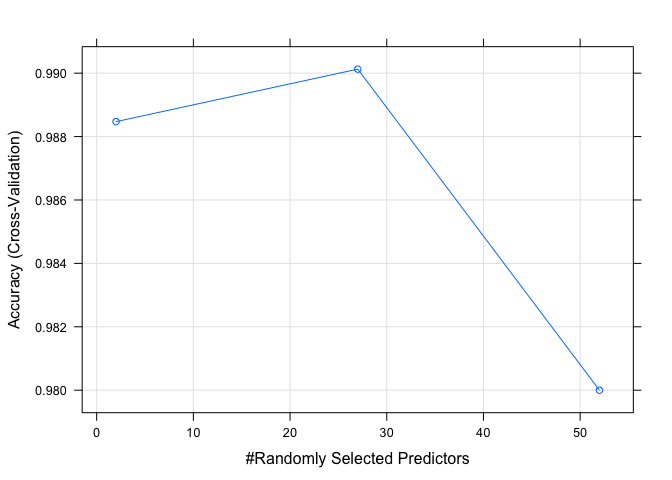
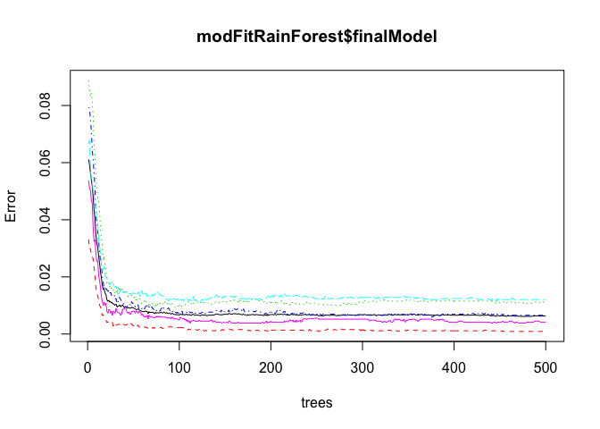

# Practical Machine Learning Project : Prediction Assignment Writeup

author: Oreste Parlatano
date: August 11, 2017

## Overview

The goal of this project is to predict the manner in which the exercise of collecting data from accelerometers on the belt, forearm, arm, and dumbell of 6 participants was performed. This is the "classe" variable in the training set. Is possible to use any of the other variables to predict with. The report will describe how the model was built, how the cross validation was used, what is the expected out of sample error, and explanation about the choices. The prediction model will be used to predict 20 different test cases.

## Background

Using devices such as Jawbone Up, Nike FuelBand, and Fitbit it is now possible to collect a large amount of data about personal activity relatively inexpensively. These type of devices are part of the quantified self movement – a group of enthusiasts who take measurements about themselves regularly to improve their health, to find patterns in their behavior, or because they are tech geeks. One thing that people regularly do is quantify how much of a particular activity they do, but they rarely quantify how well they do it. In this project, the goal will be to use data from accelerometers on the belt, forearm, arm, and dumbell of 6 participants. They were asked to perform barbell lifts correctly and incorrectly in 5 different ways. More information is available from the website here: http://groupware.les.inf.puc-rio.br/har (see the section on the Weight Lifting Exercise Dataset).

## Data Acquisition and Environment setup


```r
setwd('/Users/Oreste/Documents/datascience/Machine_learning/Final_assignment')
if (!file.exists('training.csv')) {
  url_training <- 'https://d396qusza40orc.cloudfront.net/predmachlearn/pml-training.csv'
  download.file(url_training, destfile = 'training.csv')
}
if (!file.exists('testing.csv')) {
  url_testing <- 'https://d396qusza40orc.cloudfront.net/predmachlearn/pml-testing.csv'
  download.file(url_testing, destfile = 'testing.csv')
}
training <- read.csv('training.csv')
testing <- read.csv('testing.csv')
```


## Exploratory Analysis

The dataset is already splitted in a training and test dataset. The training dataset contains 19622 observations from 160 variables. The outcome is given by the variable 'classe' in the last column which is a factor variable with 5 levels A,B,C,D,E. Each class is present in the training dataset, but is not present in the test dataset where it is replaced by the variable 'problem_id' for identification purposes of the 20 test cases for the submission of the prediction results. Training dataset contains a a lot of missing values marked as NA.


```r
dim(training)
```

```
## [1] 19622   160
```

```r
str(training$classe)
```

```
##  Factor w/ 5 levels "A","B","C","D",..: 1 1 1 1 1 1 1 1 1 1 ...
```

```r
summary(training$classe)
```

```
##    A    B    C    D    E 
## 5580 3797 3422 3216 3607
```

```r
names(training)[names(testing) != names(training)]
```

```
## [1] "classe"
```

```r
names(testing)[names(testing) != names(training)]
```

```
## [1] "problem_id"
```

```r
sum(is.na(training))
```

```
## [1] 1287472
```

```r
sum(is.na(testing))
```

```
## [1] 2000
```


## Building model

### Reduce dataframe

Only the variables which are related to the raw measurements from the sensors located on the belt, forearm, arm, and dumbell for the physical movement during the exercise are useful for this assignment.


```r
useful_vars <- c(grep("^accel", names(training)), grep("^gyros", names(training)), grep("^magnet", names(training)), grep("^roll", names(training)), grep("^pitch", names(training)), grep("^yaw", names(training)), grep("^total", names(training)))
training2 <- training[, c(useful_vars, 160)]
testing2 <- testing[, c(useful_vars, 160)]
```

The reduced training (training2) and test (testing2) datasets have no missing values (NAs) and are consistent with the exeption of the last variable.


```r
sum(names(testing2) != names(training2))
```

```
## [1] 1
```

```r
sum(is.na(training2))
```

```
## [1] 0
```

```r
sum(is.na(testing2))
```

```
## [1] 0
```

Partitioning Training data set into two data sets,60% for train data, 40% for test data as this will be used for cross validation purpose.


```r
suppressWarnings(suppressMessages(library(caret)))
set.seed(280160)
split_training2 <- createDataPartition(training2$classe, p = 0.80, list=F)
training2train <- training2[split_training2,]
training2test <- training2[-split_training2,]
```


### Random Forests

The original paper, at paragraph 5.2, explains that a Random Forest approach was used because of the characteristic noise in the sensor data. This assignment will use the same approach.


```r
suppressWarnings(suppressMessages(library(e1071)))
suppressWarnings(suppressMessages(library(randomForest)))
controlRainForest <- trainControl(method="cv", number=3, verboseIter=FALSE)
modFitRainForest <- train(classe ~ ., 
                          data=training2train, 
                          method="rf", trControl=controlRainForest
                          )
modFitRainForest$finalModel
```

```
## 
## Call:
##  randomForest(x = x, y = y, mtry = param$mtry) 
##                Type of random forest: classification
##                      Number of trees: 500
## No. of variables tried at each split: 27
## 
##         OOB estimate of  error rate: 0.63%
## Confusion matrix:
##      A    B    C    D    E  class.error
## A 4460    1    2    0    1 0.0008960573
## B   24 3004    8    1    1 0.0111915734
## C    0   11 2720    7    0 0.0065741417
## D    1    1   27 2542    2 0.0120481928
## E    0    3    2    7 2874 0.0041580042
```


### Cross Validation


```r
predictionRF <- predict(modFitRainForest, newdata=training2test)
confusionRF <- confusionMatrix(predictionRF, training2test$classe)
confusionRF
```

```
## Confusion Matrix and Statistics
## 
##           Reference
## Prediction    A    B    C    D    E
##          A 1113    3    0    0    0
##          B    1  756    4    0    0
##          C    2    0  677    7    0
##          D    0    0    3  636    2
##          E    0    0    0    0  719
## 
## Overall Statistics
##                                           
##                Accuracy : 0.9944          
##                  95% CI : (0.9915, 0.9965)
##     No Information Rate : 0.2845          
##     P-Value [Acc > NIR] : < 2.2e-16       
##                                           
##                   Kappa : 0.9929          
##  Mcnemar's Test P-Value : NA              
## 
## Statistics by Class:
## 
##                      Class: A Class: B Class: C Class: D Class: E
## Sensitivity            0.9973   0.9960   0.9898   0.9891   0.9972
## Specificity            0.9989   0.9984   0.9972   0.9985   1.0000
## Pos Pred Value         0.9973   0.9934   0.9869   0.9922   1.0000
## Neg Pred Value         0.9989   0.9991   0.9978   0.9979   0.9994
## Prevalence             0.2845   0.1935   0.1744   0.1639   0.1838
## Detection Rate         0.2837   0.1927   0.1726   0.1621   0.1833
## Detection Prevalence   0.2845   0.1940   0.1749   0.1634   0.1833
## Balanced Accuracy      0.9981   0.9972   0.9935   0.9938   0.9986
```

It results with an accuracy of **0.994392**

Summary of final model

<!-- -->

## Sample error

<!-- -->

From the above plot is possible to estimate the average error of about 1%


## Justification

The reading of the [original document](http://groupware.les.inf.puc-rio.br/work.jsf?p1=11201) in particular the paragraph 5.2, indicating the method choosen for achieving results, has been the motivation for the general approach.


## Test cases

When using the described prediction model to predict the 20 different test cases from the original test dataset testing we obtain the following predictions:


```r
predictionRF_last <- predict(modFitRainForest, newdata=testing)
print(rbind(testing[1:20, 160], as.character(predictionRF_last)))
```

```
##      [,1] [,2] [,3] [,4] [,5] [,6] [,7] [,8] [,9] [,10] [,11] [,12] [,13]
## [1,] "1"  "2"  "3"  "4"  "5"  "6"  "7"  "8"  "9"  "10"  "11"  "12"  "13" 
## [2,] "B"  "A"  "B"  "A"  "A"  "E"  "D"  "B"  "A"  "A"   "B"   "C"   "B"  
##      [,14] [,15] [,16] [,17] [,18] [,19] [,20]
## [1,] "14"  "15"  "16"  "17"  "18"  "19"  "20" 
## [2,] "A"   "E"   "E"   "A"   "B"   "B"   "B"
```
